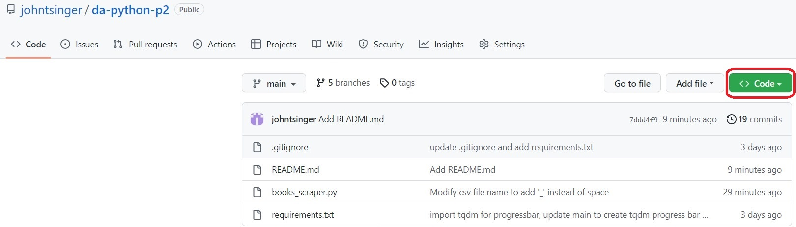
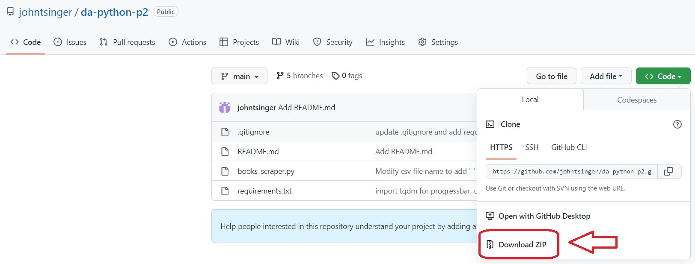
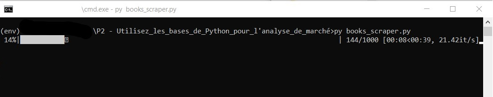

# Python Application Developer - P2 - Use Python basics for market analysis

## Description

A Python web scraper of the site [Books to Scrape](http://books.toscrape.com/). Extracts data from all books of the site and saves them in separate csv files named after the category to which they belong and time-stamped in ISO 8601 format `<category_name_YYYYMMDDTHHMMSS>.csv`, sorted by category in folders named `<category_name>/`, in a folder in the project root named `scraped_data/`

Also saves the images of the books of each category in jpg files named `<book_title>.jpg` in a folder named `images/` located in the `<category_name>/` folders of the `scraped_data/` folder :
- `da-python-p2/`
  - `scraped_data/`
    - `<category_name>/`
      - `images/`
        - `<book_title>.jpg`
      - `<category_name_YYYYMMDDTHHMMSS>.csv`

## Installation guide

### Clone repository with Git :

    git clone https://github.com/ndohvich/da_python_p2.git
    
or

### Download the repository :

- On the [project page](https://github.com/ndohvich/da_python_p2.git)
- Click on Code

    
  
- Click on download ZIP :

    
     
- Extract the file.

### Install Python :

**Requires Python 3.8 or higher**

If you don't have Python 3 or if you have an older release, please visit : https://www.python.org/downloads/ to download it !

### Virtual Environment :

#### Create a virtual environment in the project root :

Open a command prompt and go to the project location.\
Please note that `<environment name>` is a name you choose, for more convenience we use `env`.

    python -m venv <environment name>

#### Activate a virtual environment :

##### windows :

    <environment name>/Scripts/activate
    
##### linux/mac :

    source <environment name>/bin/activate
    
#### Install dependencies :

    pip install -r requirements.txt
    
## Run the scraper

    python books_scraper.py

Please wait until the process is completed! You will find the data, as described in the [Descrpition](#description) section, in the `scraped_data/` folder.
    
## Contact :
NDOH NDOH Jules Yannick - ndohmoise@gmail.com
Project link : https://github.com/ndohvich/da_python_p2